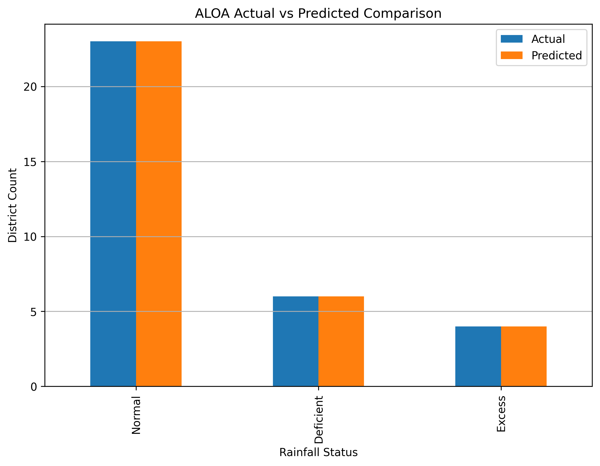

# 🌧️ Rainfall Deficiency Prediction System  
   
## 🧠 Predicting Rainfall Deficiency using Machine Learning & Bio-Inspired Optimization  
 
---

## 👤 Author

**Sagnik Patra**

---

## 📌 Project Overview
 
This project builds an end-to-end **Rainfall Deficiency Prediction System** using Machine Learning and Bio-Inspired Optimization Algorithms.

The system analyzes historical rainfall data of Rajasthan districts, performs feature engineering, applies optimization-based feature selection, and predicts rainfall deficiency categories using optimized machine learning models.

The project automatically generates:

- Prediction CSV files
- Result CSV files
- Model files
- Configuration files
- Accuracy reports
- Visualization graphs
- Heatmaps
- Confusion matrices

---



---

## 🎯 Objectives

- Analyze rainfall deficiency patterns
- Predict rainfall status using machine learning
- Perform feature engineering on rainfall data
- Optimize feature selection using bio-inspired algorithms
- Generate prediction and result reports
- Save trained models and configuration files
- Visualize rainfall prediction performance

---

## ⚙️ Tech Stack

- Python
- Pandas
- NumPy
- Scikit-learn
- TensorFlow / Keras
- Matplotlib
- Seaborn
- Joblib
- YAML
- JSON

---

## 🧬 Optimization Algorithms Used

- AIS - Artificial Immune System
- CSA - Crow Search Algorithm
- PSO - Particle Swarm Optimization
- QPSO - Quantum Particle Swarm Optimization
- BA - Bat Algorithm
- ALOA - Ant Lion Optimization Algorithm

---

## 📂 Dataset

```text
RJ_Session_247_AU_1955.2.csv
